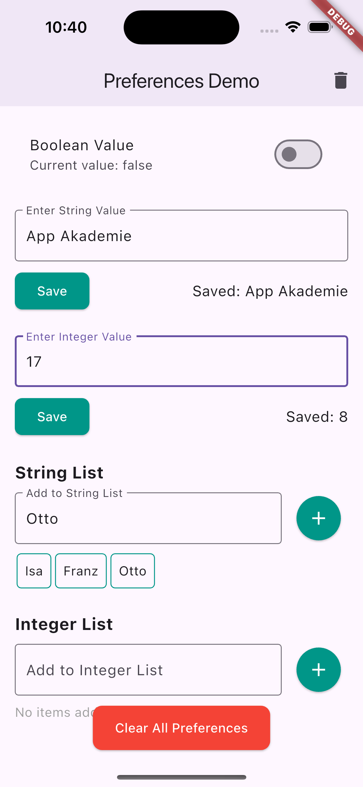

# shared_preferences_exercise

Mittelgroße App, das die grundlegende Verwendung von SharedPreferences in Flutter zeigt.

Es werden verschiedene Datentypen gespeichert und gelesen. Nach einem Neustart der App sollten die gespeicherten Daten noch vorhanden sein.

Außerdem können alle Daten gelöscht werden.

## Screenshots

Home Screen                       |
:--------------------------------:
{width=100}